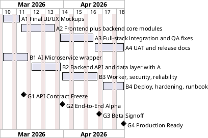

# PID Parser SaaS Roadmap (Mar 1, 2026 - Apr 30, 2026)

## Team Mapping
- Intern A: Full-stack lead (frontend owner + backend core contributor)
- Intern B: Backend platform + AI microservice owner

Keep labels as A and B in project tracking.

## Project Goal
Build a production micro SaaS where a user can:
1. Visit Home, Pricing, About pages
2. Sign up / log in
3. Start free or paid subscription
4. Upload PID PDF/image
5. Track processing status
6. View result overlays + graph
7. Download outputs (JSON, CSV, images)

Use existing `giza-pidparser` logic. Do not rebuild the detection algorithm.
Target is full capability parity with current PoC behavior.

## Plans and Usage Limits
- Max upload file size: 5 MB per file (hard limit)
- Allowed file types: PDF, JPG, JPEG, PNG
- Free plan:
1. Up to 5 files per day per user
2. Standard queue priority
- Paid plan ($20/month):
1. Up to 1000 files per month per user
2. Higher queue priority
3. Billing and subscription management enabled

## Required SaaS Pages and Flows
- Public pages:
1. Home
2. Pricing
3. About
- Auth pages:
1. Login
2. Signup
3. Forgot password
- App pages:
1. Dashboard
2. Upload
3. Job history/status
4. Result details
5. Account/Billing

Subscription flow:
1. User chooses Free or Paid on pricing page
2. Paid checkout creates active subscription
3. Quotas enforced by plan
4. Usage counters reset daily/monthly by plan rules
5. Upgrade/downgrade/cancel available in billing page

## Stack
- Frontend: React + Vite + Tailwind + React Router
- Backend API: Node.js (LTS) + Express
- DB: PostgreSQL
- File storage: object storage with private buckets
- AI microservice: Python + FastAPI (wrap existing `giza-pidparser`)
- Queue model: DB job table + one worker process (no Redis in phase 1)
- Hosting:
1. Frontend: static hosting
2. Backend + worker: one small container/service
3. AI microservice: separate small CPU container first; GPU only if needed
4. Managed payment gateway for subscriptions

## Production Capacity Targets
- Support at least 50 daily active users
- Handle at least 250 file uploads/day at free-tier limits
- File size up to 5 MB enforced at API and UI
- Staging load test target:
1. 10 concurrent active users
2. 95% of uploads are accepted by API in under 3 seconds
3. 95% of jobs move to `processing` in under 15 seconds
4. 95% of jobs complete within 10 minutes (for files <= 5 MB)
- System remains usable under concurrent usage from 10 active sessions

## Required AI Capability Parity
Production SaaS must preserve current parser behavior end-to-end.

The AI microservice must cover:
1. PDF to image conversion (high DPI)
2. Image preprocessing (invert, thresholding, skeletonization)
3. Line extraction and contour logic
4. Multi-model object detection as in current pipeline
5. Bounding box post-processing (merge, nested cleanup)
6. Line detection (solid and dashed)
7. Graph generation from detections
8. Artifact generation used by UI (overlays, graph output, structured result files)

SaaS result page must expose all produced outputs currently available in PoC:
1. detection overlays
2. graph visualization
3. structured outputs for download

## PlantUML Gantt Overview

## Milestones for Intern A (Full-Stack Lead)

### A1. Final UI/UX Mockups (Mar 1 - Mar 10)
What A must deliver:
- Final screen designs for:
1. Home
2. Pricing
3. About
4. Login/Signup
5. Dashboard, upload, job status, results, billing
- Mobile + desktop versions.
- Loading, empty, and error states.
- Pricing and quota messaging for Free/Paid plans.

Done means:
- You can click through the full user journey in design prototype.
- No unclear screen behavior remains.

### A2. Frontend + Backend Core Implementation (Mar 11 - Mar 27)
What A must deliver:
- React pages and routes for all required public/auth/app screens.
- Form validation for file type/size.
- Job status polling UI (`queued`, `processing`, `completed`, `failed`).
- Backend core contribution in Node.js:
1. auth endpoints
2. upload endpoint
3. job create/status/result endpoints (with B)
- Billing UI and subscription state handling:
1. current plan
2. usage counters
3. upgrade button
- Results viewer with:
1. input preview
2. overlay image panel
3. graph panel (iframe or embed)
4. download buttons

Done means:
- Full flow works with mock API first, then real API contract.
- Core backend routes are merged and tested.

### A3. Full-Stack Integration + QA Fixes (Mar 28 - Apr 15)
What A must deliver:
- Integrate real backend responses and error codes.
- Coordinate backend integration with B:
1. API contract final shape
2. response/error schema consistency
3. artifact link mapping on result page
- Fix UX defects found in alpha testing.
- Basic accessibility fixes (keyboard tab, labels, button names).
- Frontend test coverage for critical paths:
1. auth
2. upload
3. status polling
4. results rendering
5. plan limit messaging and billing status

Done means:
- Alpha to beta UI is stable on Chrome + Edge.
- End-to-end flow is verified by A on staging.

### A4. UAT + Release Docs (Apr 16 - Apr 30)
What A must deliver:
- UAT issue fixes.
- Simple frontend README:
1. run locally
2. env variables
3. build command
4. deploy command
- SaaS admin/demo guide:
1. create test free user
2. create test paid user
3. verify quotas and billing states

Done means:
- Product owner can run and demo frontend without help.

## Milestones for Intern B (Backend + AI Service)

### B1. AI Microservice Wrapper (Mar 1 - Mar 14)
What B must deliver:
- FastAPI service wrapping existing parser pipeline.
- Endpoints:
1. `POST /parse`
2. `GET /health`
- Output schema with:
1. symbol/line detection data
2. artifact file list
3. status and error message
- Feature parity matrix against current PoC pipeline steps and outputs.

Done means:
- Service processes sample files successfully and returns stable JSON.
- Parity matrix is reviewed and accepted.

### B2. Backend API + DB + Uploads (Shared with A) (Mar 15 - Mar 30)
What B must deliver:
- Co-own Express backend with A:
1. auth/upload/job endpoints
2. API validation and error handling
- Own PostgreSQL schema quality for users, jobs, artifacts.
- File upload to object storage.
- Own DB migrations and review all backend PRs from A.
- Implement plan/usage model:
1. plan table
2. usage counters (daily/monthly)
3. quota check middleware
- Integrate payment webhook handling for subscription state.

Done means:
- Authenticated user can create a job and see stored status records.
- API contract is stable and shared with A.
- Free and paid plan limits are enforced correctly.

### B3. Worker + Job Pipeline + Security (Mar 31 - Apr 17)
What B must deliver:
- Worker reads pending jobs, calls AI microservice, stores outputs.
- Retry once for transient failures.
- File validation: allowed type + max size.
- Access control: user only sees own jobs/files.
- Structured logs per job id.
- Add operational checks:
1. failure alerts
2. processing timeout guard
3. basic throughput measurement
- Queue priority by plan (paid ahead of free).

Done means:
- End-to-end alpha works and failure cases are visible in logs.
- Beta build is stable for repeated runs.
- For benchmark sample inputs, SaaS outputs match PoC output set (artifact-level parity).
- Load test confirms target usage profile is stable.

### B4. Deploy + Hardening + Runbook (Apr 18 - Apr 30)
What B must deliver:
- Deploy backend, worker, AI microservice, DB, and storage config.
- Health checks and uptime verification.
- Billing webhook and subscription events verified in staging.
- Simple ops runbook:
1. restart services
2. rotate keys
3. rollback
4. check failed jobs
5. verify plan limits and reset counters

Done means:
- Team can deploy and recover system using docs.
- Production checklist for 50 DAU is signed off.

## Non-Negotiable Acceptance Checklist
- Reused old parser logic through separate AI microservice.
- Full user flow works end-to-end.
- Home, Pricing, About, Auth, Dashboard, Billing pages are complete.
- Free and paid subscriptions work with quota enforcement.
- File limit policy enforced: max 5 MB/file.
- Full PoC AI functionality is available in microservice + web app flow.
- Output set parity confirmed against baseline sample set before production.
- Job status is visible and accurate.
- User data is isolated by auth.
- All core services have README + `.env.example`.
- Demo can be run by faculty/client from docs.
- Load/stability test completed for target usage profile.
